# Client Manager Demo

[]()
[]()
[]()
[]()
[](https://travisnickels.github.io/ClientManagerDemo/)

A full-stack, event-driven demo application that demonstrates modern distributed architecture with .NET 9, PostgreSQL, RabbitMQ, Vue 3 (Vite + Pinia), and Docker Compose.
Designed to showcase scalable, testable patterns and production-grade developer workflows.

## 🧩 Overview

This project simulates a simplified Client Management System with real-time updates across multiple services.

When a new client is created:

1. The API receives the HTTP request.
2. The API publishes a message to RabbitMQ.
3. The Worker consumes the message, persists data to PostgreSQL, and emits an event.
4. The API broadcasts that event to connected frontends via SignalR.
5. The frontend reacts in real time via Pinia state updates.

This demonstrates a complete asynchronous workflow loop (API → Queue → Worker → Database → Event → Frontend).

## 🧠 Goals

- Showcase distributed service architecture.
- Demonstrate reliable message-based integration with RabbitMQ.
- Provide automated health checks and containerized development.
- Support live-reload development across backend and frontend.
- Serve as a foundation for BDD-driven feature expansion.

## 🔩 Architecture

```mermaid
flowchart LR
    subgraph ClientSide[Client Side]
        FE[Frontend<br/>Vue 3 + Pinia]
    end

    subgraph ServerSide[Server Side]
        API[API<br/>ASP.NET 9]
        MQ[RabbitMQ<br/>Broker]
        WRK[Worker<br/>.NET Worker]
        DB[PostgreSQL]
    end

    %% Synchronous Flows (solid green)
    FE -->|HTTP| API
    API -->|Query GET requests| DB
    API -->|SignalR / Broadcast events| FE

    %% Asynchronous Flows (dashed blue)
    API -.->|Publish message| MQ
    MQ -.->|Consume message| WRK
    WRK -.->|Persist data| DB
    WRK -.->|Publish event| MQ
    MQ -.->|Deliver event| API

    %% Styling
    classDef sync stroke:#4CAF50,stroke-width:2px;
    classDef async stroke:#2196F3,stroke-width:2px,stroke-dasharray: 5 5;
    class FE,API,DB sync
    class MQ,WRK async
    linkStyle 0,1,2 stroke:#22C55E,stroke-width:2px;
    linkStyle 3,4,5,6,7 stroke:#3B82F6,stroke-width:2px,stroke-dasharray: 5 5;

    %% Legend
    classDef legendBox fill:none,stroke:none,color:#444,font-size:12px,text-align:left;
    L1(["🟩 Solid Green → Synchronous (HTTP / SignalR / DB Reads)"])
    L2(["🟦 Dashed Blue → Asynchronous (Message Queue / Worker)"])
    L1:::legendBox
    L2:::legendBox

```



### Technologies Used

| Layer          | Technology                    | Description                                             |
| -------------- | ----------------------------- | ------------------------------------------------------- |
| Frontend       | Vue 3, Vite, Pinia            | Reactive UI with real-time updates via SignalR          |
| API            | ASP.NET Core 9                | REST endpoints, SignalR hub, and RabbitMQ publisher     |
| Worker         | .NET 9 Worker Service         | Background consumer that persists data and emits events |
| Messaging      | RabbitMQ                      | Reliable async communication between API and Worker     |
| Database       | PostgreSQL                    | Persistent client storage                               |
| Infrastructure | Docker Compose                | Multi-service setup with health checks                  |
| Testing        | NUnit + FluentAssertions      | Unit and integration testing across API and Worker      |
| Dev Experience | Hot reload and shared volumes | Fast feedback loop for backend and frontend             |

## ⚙️ Setup and Run

### Prerequisites

- Docker and Docker Compose
- .NET 9 SDK
- Node.js 24+

### Quick Start

```bash
git clone https://github.com/TravisNickels/ClientManagerDemo.git
cd ClientManagerDemo/src
npm run docker:start
```

This will start in the following order with health checks:

- PostgreSQL
- RabbitMQ (management UI at http://localhost:15672)
- Worker background service
- API at http://localhost:5200
- Frontend at http://localhost:5173

## 🩺 Health Checks

Each backend service exposes a simple readiness probe:

| Service    | Health Check                                               |
| ---------- | ---------------------------------------------------------- |
| PostgreSQL | `pg_isready -U <user>`                                     |
| RabbitMQ   | `rabbitmq-diagnostics ping`                                |
| API        | `GET /health` endpoint                                     |
| Worker     | Log-based check for "Worker running at" message on startup |

## 🧪 Testing

Testing follows clear separation between API (request/response verification) and Worker (data persistence and side effects), aligning with real-world distributed testing practices.

### Backend

- Unit tests for domain logic and services.
- Integration tests for API endpoint, RabbitMQ publishing, and Worker database writes

```bash
dotnet test
```

### Frontend

- Vitest for component tests
- Playwright (planned) for E2E UI workflow testing

```bash
cd frontend
npm run test
```

## 🔁 Developer Workflow

### Hot Reload Support

The backend and frontend run in watch mode within Docker containers. You can edit source files locally and see changes reflected live.

### Environment Variables

Defined in `.env`:

```bash
POSTGRES__Host=localhost
POSTGRES__Port=5432
POSTGRES__User=postgres
POSTGRES__Password=postgres
POSTGRES__Database=clientManagerDB
POSTGRES__Schema=public
RABBITMQ__URL="amqp://localhost"
RABBITMQ__AmqpPort=5672
RABBITMQ__ManagementPort=15672
RABBITMQ__Username="guest"
RABBITMQ__Password="guest"
RABBITMQ__VirtualHost="/"
FRONTEND__HOST=localhost
VITE_API__Host=localhost
VITE_API__Port=5200
VITE_API__Version=1
```

## 🤖 Future Enhancements

| Category             | Planned Work                                                |
| -------------------- | ----------------------------------------------------------- |
| Stability            | Retry policy, Dead-letter queue, idempotent consumer        |
| Developer Experience | Auto migrations, simplified docker-compose overrides        |
| Testing              | End-to-end test harness with domain specific language (DSL) |
| Observability        | Better logging, distributed trace IDs, metrics dashboard    |

## 👨‍💻 Author

**Travis Nickels**  
Software Engineer focused on workflow automation, developer experience, and distributed systems.  
_Previously at Particular Software (NServiceBus Platform)._
