# Client Manager Demo

[]()
[]()
[]()
[]()
[]()
[]()
[](https://travisnickels.github.io/ClientManagerDemo/)

## 🧩 Overview

A full-stack, event-driven demo that models a small distributed system using .NET 9, RabbitMQ, PostgreSQL, Vue 3, and Docker Compose. The goal is to show how a modern system behaves when responsibilities are separated across services, messages drive the workflow, and the UI updates in real time.

This project implements a lightweight client management flow, but the domain is not the point, the architecture is.

End-to-end workflow

1. The API receives an HTTP request and publishes a command to RabbitMQ.
2. The Worker consumes the command, applies the write model, and persists data to PostgreSQL.
3. The Worker emits an event to RabbitMQ.
4. The API consumes that event and broadcasts it to the frontend using SignalR.
5. The Vue frontend updates state in real time through Pinia.

The result is a complete async pipeline (API → Queue → Worker → Database → Event → Frontend) with clean boundaries between each step. It’s small enough to understand quickly, but accurate enough to reflect how real distributed systems behave.

## 🎯 Engineering Goals

- Model a real distributed system with clear separation of responsibilities
- Demonstrate reliable async messaging with RabbitMQ.
- Provide real-time UX using SignalR + Vue3 + Pinia
- Show clean testing architecture for both synchronous and event-driven flows
- Recreate a production-grade local environment with Docker, health checks, and hot reload

## 🚀 Quickstart

### Prerequisites

- Docker and Docker Compose
- .NET 9 SDK
- Node.js 24+

### Run the full system

```bash
git clone https://github.com/TravisNickels/ClientManagerDemo.git
cd ClientManagerDemo/src
npm run docker:start
```

This will start the docker services in the following order with health checks:

- PostgreSQL
- RabbitMQ (management UI at http://localhost:15672)
- Worker background service
- API at http://localhost:5200
- Frontend at http://localhost:5173

> [!NOTE]
> Swagger UI can be accessed at http://localhost:5200/swagger/index.html to view the API resources when running in development mode `npm run docker:dev`

### Stop and cleanup

This will stop the demo and remove all containers, volumes, and images created by it.

> [!WARNING]
> This permanently deletes demo data.  
> Safe as long as you have not attached the demo to shared Docker volumes.

```bash
npm run docker:stop
```

## 🔩 Architecture

This project is built around a simple idea:  
**read operations stay synchronous, write operations go async.**

The API responds fast, does only the work it needs to, and offloads everything else to RabbitMQ. The Worker picks up the heavier tasks like validation, domain logic, persistence, and event generation without blocking the caller. It’s the same pattern used in real distributed systems to keep services decoupled, resilient, and hard to break.

At a high level:

- **The API acts as the read model and command publisher.**  
  It serves HTTP requests, publishes commands to the queue, and broadcasts events in real time via SignalR.
- **The Worker acts as the write model.**  
  It processes commands, enforces business rules, updates the database, and emits domain events when state changes.
- **RabbitMQ is the transport layer that connects everything.**  
  Commands and events flow through it in a consistent, observable way.
- **A consistent message envelope**  
  Correlation IDs, causation IDs, and context metadata flow through both pipelines so you can trace a request from the moment it enters the API all the way to the UI update.

The system stays intentionally small, but the architecture reflects what you’d expect in a real production environment; clear boundaries, async workflows, predictable message flow, and a frontend that always reflects the latest state in real time.

### End-to-End Communication Flow (Sync + Async)


### Message publish pipeline

```mermaid
sequenceDiagram
    autonumber

    %% ====================
    %% PARTICIPANTS
    %% ====================
    participant Handler as 🟩 Message Handler
    participant Publisher as 🟦 MessagePublisher
    participant PubPipe as 🟦 MessagePublishPipeline
    participant P1 as MessageValidation<br/>Middleware
    participant P2 as ContextEnrichment<br/>Middleware
    participant Router as 🟦 RoutingConvention
    participant MQ as 🟦 RabbitMQ<br/>(Outbound Event)

    %% ====================
    %% PUBLISH FLOW (ASYNC)
    %% ====================
    Note over Handler,MQ: 🟦 **Outbound Asynchronous Publish Pipeline**

    Handler ->> Publisher: Publish(event)
    Publisher ->> PubPipe: Execute(event)

    %% ====================
    %% PUBLISH MIDDLEWARE
    %% ====================
    Note over PubPipe,Router: 🟩 **Synchronous Publish Middleware Chain**

    PubPipe ->> P1: Invoke(event)
    P1 -->> PubPipe: Validated event

    PubPipe ->> P2: Invoke(event)
    P2 -->> PubPipe: Context enriched (AsyncLocal)

    %% ====================
    %% ROUTING + TRANSPORT
    %% ====================
    PubPipe ->> Router: ResolveRoute(event)
    Router -->> PubPipe: Exchange + Routing Key
    PubPipe ->> MQ: Publish outbound event

    %% ====================
    %% DONE
    %% ====================
    MQ -->> PubPipe: ACK
    PubPipe -->> Publisher: done
    Publisher -->> Handler: done
```



### Message consume pipeline

```mermaid
sequenceDiagram
    autonumber

    %% ====================
    %% PARTICIPANTS
    %% ====================
    participant MQ as 🟦 RabbitMQ<br/>(Inbound Message)
    participant Consumer as 🟦 RabbitMQMessageConsumer
    participant Pipeline as 🟩 MessageConsumePipeline
    participant M1 as ExtractEnvelope<br/>Middleware
    participant M2 as ResolveMessageType<br/>Middleware
    participant M3 as ExtractMessage<br/>Middleware
    participant M4 as ScopeMessageContext<br/>Middleware
    participant Handler as 🟩 Message Handler
    participant DB as 🟩 PostgreSQL / EF Core
    participant Publisher as 🟦 MessagePublisher
    participant PubPipe as 🟦 MessagePublishPipeline
    participant MQ2 as 🟦 RabbitMQ<br/>(Outbound Event)

    %% ====================
    %% INBOUND FLOW (ASYNC)
    %% ====================
    Note over MQ,Pipeline: 🟦 **Inbound Asynchronous Message Flow**
    MQ ->> Consumer: Message delivered<br/>(raw bytes)
    Consumer ->> Pipeline: pipeline.Execute(message)

    %% ====================
    %% MIDDLEWARE SEQUENCE
    %% ====================
    Note over Pipeline,Handler: 🟩 **Synchronous Middleware Pipeline**
    Pipeline ->> M1: Invoke()
    M1 -->> Pipeline: Envelope extracted

    Pipeline ->> M2: Invoke()
    M2 -->> Pipeline: Message type resolved

    Pipeline ->> M3: Invoke()
    M3 -->> Pipeline: Message body deserialized

    Pipeline ->> M4: Invoke()
    M4 -->> Pipeline: Scoped MessageContext created

    %% ====================
    %% HANDLER
    %% ====================
    Note over Handler,DB: 🟩 **Business Logic / Write Model**
    Pipeline ->> Handler: Invoke(message)
    Handler ->> DB: Persist domain changes

    %% ====================
    %% OUTBOUND FLOW (ASYNC)
    %% ====================
    Note over Handler,MQ2: 🟦 **Outbound Asynchronous Event Flow**
    Handler ->> Publisher: Publish(event)
    Publisher ->> PubPipe: Execute(event)
    PubPipe ->> MQ2: Publish outbound event

    %% ====================
    %% DONE
    %% ====================
    MQ2 -->> PubPipe: ACK
    PubPipe -->> Publisher: done
    Publisher -->> Handler: done

```



### Technologies Used

| Layer          | Technology                     | Description                                                   |
| -------------- | ------------------------------ | ------------------------------------------------------------- |
| Frontend       | Vue 3, Vite, Pinia             | Reactive UI with real-time updates via SignalR                |
| API            | ASP.NET Core 9                 | REST endpoints, SignalR hub, and RabbitMQ publisher           |
| Worker         | .NET 9 Worker Service          | Background consumer that persists data and emits events       |
| Messaging      | RabbitMQ                       | Reliable async communication between API and Worker           |
| Database       | PostgreSQL                     | Persistent client storage                                     |
| Infrastructure | Docker Compose                 | Multi-service setup with health checks                        |
| Testing        | NUnit, Vitest, Testing library | Unit and integration testing across API, Worker, and frontend |
| Dev Experience | Hot reload and shared volumes  | Fast feedback loop for backend and frontend                   |

## ⚖️ Trade-offs & Design decisions

This demo makes a handful of deliberate trade-offs. The goal wasn’t to build the most complex system possible, it was to show how a real system behaves when you keep responsibilities clear and resist unnecessary complexity.

Some of these choices would likely change in a production system. For a demo, they keep the focus on message flow, boundaries, and behavior instead of ceremony.

### Read vs Write Separation (Without Going Full CQRS)

Reads and writes are intentionally split by responsibility:

- The API handles reads and publishes commands.
- The Worker owns writes and domain changes.

Both use the same PostgreSQL database, but through different EF Core contexts (`ReadOnlyAppDbContext` and `AppDbContext`).

I didn’t split this into multiple databases or projections on purpose. That would add a lot of moving parts without making the demo easier to understand. This keeps the boundary clear while staying pragmatic.

### Async Writes, Sync Reads

- Anything that changes state goes through RabbitMQ.
- Reads stay synchronous.

This keeps the API responsive and avoids long-running requests. The Worker can do the heavier work without blocking callers.

Yes, this introduces eventual consistency. That’s intentional. The system behaves the way real distributed systems do.

### EF Core over Dapper

I chose EF Core over Dapper because persistence isn’t the point of this demo. EF Core keeps the write model simple, transactional, and easy to test, while letting the focus stay on messaging, boundaries, and system behavior. Dapper would be a good fit in a performance-critical system, but it would add noise here without improving the story.

### Message Pipelines

Both message consumption and publishing run through explicit middleware pipelines.

I could have hidden this behind a framework like NServiceBus or MassTransit, but I wanted message flow and context propagation to be visible. You can trace a message from the moment it’s received, through the handler, to the outbound event without guessing what’s happening.

It’s more code, but it’s also easier to reason about.

### SignalR for Notifications, Not State

SignalR is used to notify the frontend that something changed, not to act as the source of truth.

The API still returns data as part of normal HTTP responses, but the frontend typically follows up with a query after receiving a SignalR notification to ensure it’s working with the latest state.

This avoids dual-write problems and keeps responsibilities clear. SignalR drives reactivity, while the API owns correctness. The UI may briefly show stale data, but correctness and consistency matter more than optimistic cleverness.

### No Sagas, No Distributed Transactions

That’s not because they’re bad, it’s because they’re expensive. You only earn that complexity when the problem demands it. This project focuses on the core message flow first, with clear extension points for retries, DLQs, and orchestration later.

### Testing at Service Boundaries

Tests are split by responsibility:

- API tests verify requests and message publishing
- Worker tests verify persistence and side effects
- Frontend tests focus on state updates and real-time behavior

This mirrors how distributed systems are usually tested in practice. End-to-end tests are useful, but they’re not where most confidence comes from.

## 🩺 Health Checks

Each backend service exposes a simple readiness probe:

| Service    | Health Check                           |
| ---------- | -------------------------------------- |
| PostgreSQL | `pg_isready -U <user>`                 |
| RabbitMQ   | `rabbitmq-diagnostics ping`            |
| API        | `GET /health` endpoint                 |
| Worker     | File `healthy` written to a tmp folder |

## 🧪 Testing

Testing follows clear separation between API (request/response verification) and Worker (data persistence and side effects), aligning with real-world distributed testing practices.

### Backend

- Unit tests for API + Worker domain logic
- Integration tests for:
  - API endpoint → RabbitMQ publishing
  - Worker → PostgreSQL writes
  - Event emission

```bash
dotnet test
```

### Frontend

- Vitest component tests
- SignalR fully mocked using a custom factory
- Playwright E2E planned

```bash
cd frontend
npm run test
```

## 🔁 Developer Workflow

### Hot Reload Support

The backend and frontend run in watch mode within Docker containers. You can edit source files locally and see changes reflected live.

### Environment Variables

Defined in `.env`:

```bash
POSTGRES__Host=localhost
POSTGRES__Port=5432
POSTGRES__User=postgres
POSTGRES__Password=postgres
POSTGRES__Database=clientManagerDB
POSTGRES__Schema=public
RABBITMQ__URL="amqp://localhost"
RABBITMQ__AmqpPort=5672
RABBITMQ__ManagementPort=15672
RABBITMQ__Username="guest"
RABBITMQ__Password="guest"
RABBITMQ__VirtualHost="/"
FRONTEND__HOST=localhost
VITE_API__Host=localhost
VITE_API__Port=5200
VITE_API__Version=1
```

## 🤖 Future Enhancements

| Category             | Planned Work                                                |
| -------------------- | ----------------------------------------------------------- |
| Stability            | Retry policy, Dead-letter queue, idempotent consumer        |
| Developer Experience | Auto migrations, simplified docker-compose overrides        |
| Testing              | End-to-end test harness with domain specific language (DSL) |
| Observability        | Better logging, distributed trace IDs, metrics dashboard    |

## 👤 Author

**Travis Nickels**  
Software Engineer focused on workflow automation, developer experience, and distributed systems.  
_Previously at Particular Software (NServiceBus Platform)._
